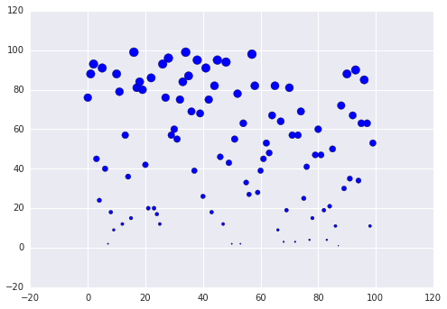
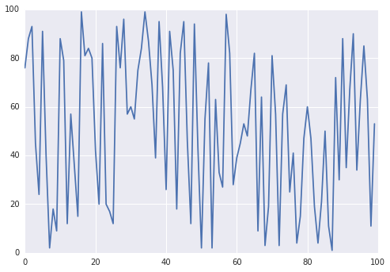

.. code:: python

    %matplotlib inline
    from numpy import random
    import matplotlib.pyplot as plt
    import seaborn as sns
.. code:: python

    z = random.random_integers(1,100,100)
.. code:: python

    plt.scatter(range(100), z, z)

.. parsed-literal::

    <matplotlib.collections.PathCollection at 0x12465fd0>

.. code:: python

    plt.plot(z)

.. parsed-literal::

    [<matplotlib.lines.Line2D at 0x12784ac8>]

